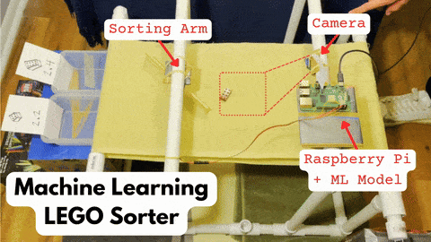

# Real-time Computer Vision LEGO Sorter




This project is a computer vision-powered LEGO sorting machine. Using a Raspberry Pi and a fine-tuned MobileNet model, LEGOs are automatically sorted by shape as they move along a conveyor belt. The system runs model inference on the Raspberry Pi via Docker, overcoming real-time performance challenges.

## Contents
- [🎯 Objective](#🎯-objective)
- [🛠️ Implementation](#🛠️-implementation)
  - [👷 Mechanical Construction](#👷-mechanical-construction)
  - [📊 Data](#📊-data)
  - [🧠 Model & Training](#🧠-model--training)
  - [🚀 Deployment](#🚀-deployment)
  - [🤖 Inference](#🤖-inference)
  - [📈 Results](#📈-results)
  - [🔮 Future Work](#🔮-future-work)
- [💻 Setup Instructions](#💻-setup-instructions)
 


## 🎯 Objective
Too many ML models never make it out of a Jupyter notebook. I wanted to deploy an ML model into the real world using Docker for real-time inferencing. The focus of this project was to get something deployed that works, rather than on fancy models and perfect accuracy.

# 🛠️ Implementation
## 👷 Mechanical Construction
After spending more time, money, and duct tape than I care to admit trying to get the conveyor belt functioning and fussing around with gearbox ratios, I realized I probably should have just 3D printed most of the components. Regardless, the first step of the project was building the following mechanical components:
 - A conveyor belt made of PVC pipes, spare cloth, and duct tape
 - A gearbox made of a DC motor, a 5V battery, LEGO Technic gears, and a box of protein shakes (for added weight).
 - A sorting arm made with a micro servo and a ruler, mounted using cardboard, duct tape, and rubber bands
 - A Raspberry Pi attached to a camera, and controlled over SSH.
   
<div style="display: flex; justify-content: space-between;">
  
  
</div>

## 📊 Data
I collected the data for this project from scratch. 

Originally, I attempted to use a LEGO dataset I found online, supplemented with a small amount of my own data, but this was unsuccessful.

I stole some LEGOs from my little brothers and separated them into a training set and a holdout testing set. To ensure the model wasn't memorizing individual bricks, I included color/shape combos in the testing set that didn't exist in the training set, like the red 2x2.


I then ran the conveyor belt and captured several dozen images for each LEGO in the training set. I also took images of the "blank" class, where no LEGO is in the frame. I captured 1200+ images total.

Near the end of the project, I noticed that during inference the model would sometimes be running with high accuracy, and then I would run it again a few hours later and it would do terribly. I eventually realized that lighting was a major issue. If the lighting in the inference images was different than in the training images, I was introducing additional complexity into the task. I put up blackout curtains in my office windows and set up several lamps to ensure good, consistent lighting. Then I recaptured my dataset.
   
## 🧠 Model & Training
For the computer vision model, I used a fine-tuned MobileNet in PyTorch. 

Initially, I used a ResNet-50 model, which had better accuracy. However, the ResNet took several seconds to complete inference on a single image, by which time the LEGO would have already passed the sorting arm. Therefore, I compared the speed and accuracy of several different models (MobileNet, EfficientNet, ViT, VGG). I ultimately decided on MobileNetV3-Large, which is optimized for speed on resource-constrained devices like the Raspberry Pi, and could process 3 frames per second. There were other models that were faster, but at the cost of lower accuracy.

I split the original training set into train/validation sets. In order to ensure the integrity of the validation set, this split was not done randomly. Because the images were captured in quick succession, a random split would lead to pictures that were nearly identical (taken 0.1 seconds apart) appearing in both the train and val splits, causing data leakage. Therefore, images were selected for the validation set in consecutive chunks of about 10 images. Similar to what was done for the testing set, I also had some color/shape combos that were exclusive to the val set.

For training, I applied transfer learning by fine-tuning the model for the specific task. This was done by freezing all the layers of the MobileNet, except for a new final linear layer.

In the first several training runs, I saw that the model was overfitting. To combat this, I added data augmentations to the train split (including flipping, scaling, rotating, and blurring), to increase the size and diversity of the training data.

## 🚀 Deployment
The next step was to containerize the application using Docker. I wanted to ensure a consistent environment between development and production, and make it easy to update or redeploy the system. The Docker image includes all necessary dependencies, such as those needed for model inference, camera feed processing, and controlling the servo motor. When running the Docker container, I had to make sure to pass specific configurations and permissions that allow access to the hardware controls on the Raspberry Pi.

One challenge was that I was developing on a Windows machine (x86/AMD architecture) and deploying on a Raspberry Pi 4B (ARM architecture). This meant that images built on my Windows machine wouldn't work for the Pi. To solve this, I used Docker's `buildx` feature, which allowed me to build multi-platform images suitable for both architectures.

I also ran into a pesky bug with servo jitter. I could get the servo to move to the correct position, but then it would jitter rapidly, which would flick LEGOs off the conveyor belt. It turns out that originally I was using a library (`RPi.GPIO`) which was generating software-based signals for the servo. However, when the CPU is under heavy loads -- like when running ML inference -- inconsistencies in the signal can be introduced. To address this, I switched to `pigpio`, which uses a dedicated hardware-based PWM signal for the servo, eliminating jitter.


## 🤖 Inference
Perhaps the biggest challenge was determining how to convert model predictions into servo actions. With the model producing 3 inferences per second, and it taking several seconds for a LEGO to move through the camera frame, the model might make 10 inferences for a single LEGO. And with imperfect classification accuracy (say 55%), the servo would switch positions multiple times for the same LEGO, leading to misclassifications, or flicking the LEGO off the conveyor belt.

However, I could use the fact that multiple images are captured to my advantage. Each image provides a different perspective, and so even if a classification is difficult when viewing a LEGO top-down, it might be easy when viewing it from an angle (or vice versa). Therefore, I implemented a voting system. Every couple of seconds, a servo move is considered. I look at the last 15 predictions and select the most common class (as long as a minimum threshold is hit). As long as the "blank" class isn't selected, a signal is sent to the servo.

To ensure that the relatively slow inferences from the ML model wouldn't interrupt the triggering of the servo, I used multiple threads. So the sorting arm operated on a separate process from the ML model.


## 📈 Results
I ran both sets of LEGOs through the final deployed model 5 times with the following results:

| Dataset | Accuracy |
|---|---|
| Training Set | 84.7% |
| Holdout Testing Set | 82.8% |


## 🔮 Future Work
 - Add more LEGO shapes to the task. This would require both retraining the model, and redesigning the sorting arm to be more precise (which is the harder part)
 - Build something that can feed LEGOs onto the conveyor belt from a bin, instead of placing LEGOs on the belt by hand
 - Use probabilities in the voting system, rather than labels. Thus, if the model is very confident about a certain label, it gets more weight than an uncertain label. 
 - Additional hyperparameter tuning

# 💻 Setup Instructions
### Hardware Setup
- I used a **Raspberry Pi 4B** (4GB RAM). Other models may require adjustments to the setup.
- Attach a camera module to the Raspberry Pi’s camera interface (CSI port).
- Connect the **servo motor** to the Raspberry Pi’s GPIO pins as follows:
  - **Power (red wire):** Connect to pin 2 (5V).
  - **Ground (black wire):** Connect to pin 6 (GND).
  - **Control (yellow wire):** Connect to pin 12 (GPIO 18).
  
Make sure your Raspberry Pi has adequate power, especially when running both the camera and servo.

### Software Setup
Clone this project repository.

Pull the Docker image.
 ```bash
 docker pull porter7678/lego-image
 ```
Install `pigpio` on the Pi for servo control.
```bash
 sudo apt-get update && sudo apt-get upgrade
 sudo apt-get install pigpio
```
Spin up the Docker container (and pigpio) and begin inference.
 ```bash
./run_docker.sh python src/predict.py
```

-----
This project was inspired by a [blog post](https://medium.com/@pacogarcia3/tensorflow-on-raspbery-pi-lego-sorter-ab60019dcf32) by Paco Garcia.
